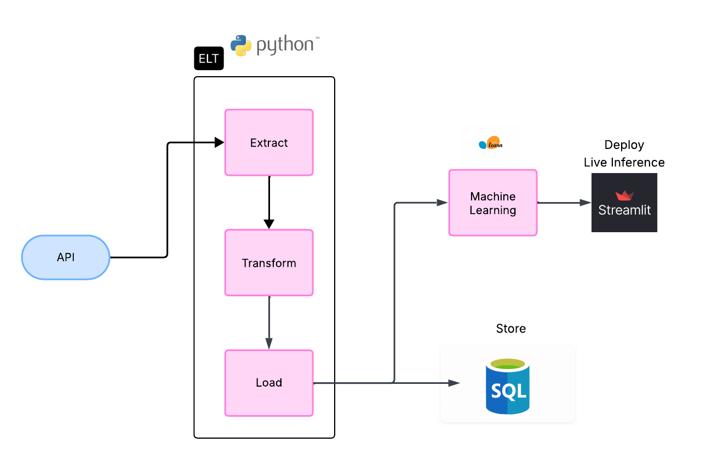

# CMS Project

## Automated End-to-End Pipeline for Medicare Payment Prediction

### Overview

This project implements a complete ETL and machine learning pipeline that:

- Extracts Medicare inpatient hospital data via the `CMS Data API`
- Transforms and cleans the data in a structured `ETL` process
- Stores the processed data in a `SQL` database
- Trains an optimized `XGBoost` regression model using a `scikit-learn` 
- Deploys a web application using `Streamlit` for real-time prediction of average Medicare payments

**Live Demo**: [Streamlit App Link](https://kensuke0529-cms-appmain-hm3nti.streamlit.app/)

---

### Key Components

#### 1. Data Ingestion (ETL): `load-etl/laod.ipynb` / `etl.ipynb`

- **Source**: [CMS Data API – Medicare Inpatient Hospitals](https://data.cms.gov/provider-summary-by-type-of-service/medicare-inpatient-hospitals/medicare-inpatient-hospitals-by-provider-and-service)
- **Extraction**: JSON records containing inpatient discharge and payment information.
- **Transformation**:
  - Selected fields: `DRG_Cd`, `year`, `Rndrng_Prvdr_State_FIPS`, `Avg_Mdcr_Pymt_Amt`
  - Validation & cleaning of raw data
- **Load**: Used `sqlalchemy` to load cleaned data into MySQL

---

#### 2. Machine Learning

- **Environment**: `ML/ML.ipynb`
- **Pipeline Structure**:
  - `ColumnTransformer`:
    - `OneHotEncoder` for categorical features
    - Pass-through for numerical features
  - Regressor: `XGBRegressor` optimized for:
    - Mean Absolute Error (MAE)
    - Mean Squared Error (MSE)
    - Root Mean Squared Error (RMSE)
    - R² Score
- **Model Persistence**: Serialized using `joblib.dump()` → `xgb_pipeline.joblib`

---

#### 3. Deployment (Streamlit App)

- **Entry Point**: `app/main.py`
- **Features**:
  - User form inputs:
    - Provider CCN
    - State FIPS
    - ZIP Code
    - DRG Code
    - Year
    - RUCA Category
  - Real-time prediction using `pipeline.predict(input_df)`
  - Output: Formatted prediction of average Medicare payment

- **Live Demo**: [Streamlit App Link](https://kensuke0529-cms-appmain-hm3nti.streamlit.app/)

## Machine Learning Pipeline

This project uses a supervised regression approach to predict average Medicare payments based on provider and service-level features. The model is trained using `XGBoost` in a `scikit-learn` pipeline, with preprocessing and hyperparameter tuning integrated.

### Workflow Summary

- **Target**: `Avg_Mdcr_Pymt_Amt` (Average Medicare Payment)
- **Preprocessing**:
  - Categorical encoding via `OneHotEncoder`
  - Grouping rare DRG codes as `"Other"`
  - Stratified train-test split using binned target quantiles
- **Model**: `XGBRegressor` wrapped in `Pipeline`
- **Tuning**: `Optuna` for hyperparameter optimization

###  Model **Performance**

| Metric        | Baseline Model | Tuned Model (Optuna) |
|---------------|----------------|-----------------------|
| MAE           | 6770.02        | **1891.11**           |
| MSE           | 106.6M         | **18.3M**             |
| RMSE          | 10325.13       | **4281.22**           |
| R² Score      | 0.6846         | **0.9458**            |
| CV MAE (5-Fold) | 6911.24 ± 594.03 |              |

---
The Mean Absolute Error (MAE) of the tuned model is 1,891, which corresponds to approximately 13.2% of the median Medicare payment value ($14,266). This indicates that, on average, the model's predictions deviate from typical values by just over 13%, which is well within acceptable bounds for healthcare payment estimation.

Similarly, the Root Mean Squared Error (RMSE) is 4,281, which is roughly 16% of the standard deviation of the target variable ($26,699). Since RMSE accounts for larger errors more heavily, this relatively low ratio demonstrates that the model not only predicts accurately on average but also controls large outlier errors effectively, despite the wide variance and skewness in the payment data.

----

###  Model Saving

The final model is saved as a `.joblib` file for later inference:
