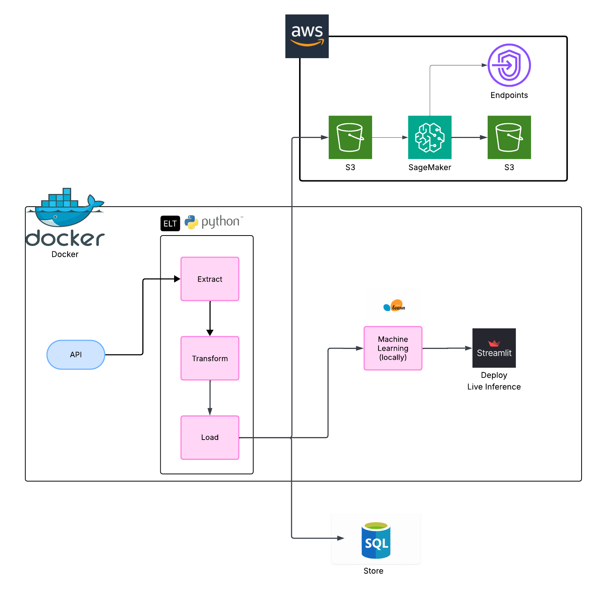

## CMS (Centers for Medicare & Medicaid Services) Medicare Payment Prediction

### Overview

This project implements a complete ETL and machine learning pipeline that:

- Extracts Medicare inpatient hospital data via the `CMS Data API`  
- Transforms and cleans the data using a structured ETL process written in `Python`, containerized with `Docker`  
- Stores the processed data in a `SQL` database  
- Trains an optimized `XGBoost` regression model using `scikit-learn`, also executed within a `Docker` container  
- Deploys a web application using `Streamlit` for real-time prediction of average Medicare payments, running in a Dockerized environment  
- Optionally, the `XGBoost` model can be trained and deployed using `AWS SageMaker`, with inference served via a hosted endpoint 

-------

### Key Components

#### 1. Data Ingestion (ETL): `load-etl/laod.ipynb` / `etl.ipynb`

- **Source**: [CMS Data API – Medicare Inpatient Hospitals](https://data.cms.gov/provider-summary-by-type-of-service/medicare-inpatient-hospitals/medicare-inpatient-hospitals-by-provider-and-service)
- **Extraction**: JSON records containing inpatient discharge and payment information.
- **Transformation**:
  - Selected fields: `DRG_Cd`, `year`, `Rndrng_Prvdr_State_FIPS`, `Avg_Mdcr_Pymt_Amt`
  - Validation & cleaning of raw data
- **Load**: Used `sqlalchemy` to load cleaned data into MySQL

---

#### 2. Machine Learning: ([ML pipeline](#machine-learning-pipeline)): `ML/ML.ipynb`, `rf_lr.ipynb`

- **Pipeline Structure**:
  - `ColumnTransformer`:
    - `OneHotEncoder` for categorical features
    - Pass-through for numerical features
  - Regressor: `XGBRegressor` optimized for:
    - Mean Absolute Error (MAE)
    - Mean Squared Error (MSE)
    - Root Mean Squared Error (RMSE)
    - R² Score
- **Model Persistence**: Serialized using `joblib.dump()` → `xgb_pipeline.joblib`
- In `rf_lr.ipynb`, implement LinearRegession and RandomForestRegression.

-----
#### 3.SQL: Data Loading & Schema Design (DDL)
The Medicare dataset was loaded using Python (sqlalchemy) into a structured relational schema.

Tables created:
- **payments**: core fact table linking provider performance to specific DRG codes
- **providers**: normalized hospital/provider metadata
- **drgs**: DRG codes and descriptions, partitioned by year

This process began with `DDL` (Data Definition Language) design to normalize the schema into 3 entities with minimal redundancy, using appropriate primary and foreign keys to enforce referential integrity.

.png)
---

#### 4. Deployment (Streamlit App): `app/main.py`

- **Features**:
  - User form inputs:
    - Provider CCN
    - State FIPS
    - ZIP Code
    - DRG Code
    - Year
    - RUCA Category
  - Real-time prediction using `pipeline.predict(input_df)`
  - Output: Formatted prediction of average Medicare payment

  

#### 5. Docker: `Dockerfile`
- Runs the ETL pipeline: Executes pipeline_wo_aws.py to extract, transform, and load Medicare data
- Starts the application: Launches the Streamlit web app for real-time prediction
- [DockerHub](https://hub.docker.com/r/ken1001/cms)

#### 6. AWS Sagemaker: `sagemaker/sagemaker.ipynb`, `sagemaker_tuning.ipynb`

- Reformatted dataset (CSV, no header/index, label in first column) for SageMaker’s XGBoost input requirements.
- Used boto3 to upload training/validation files to an S3 bucket.
- Trained XGBoost model using via the sagemaker SDKn
- Stored train results in S3 for later use
- Deployed the model as a real-time inference endpoint using SageMaker’s deploy() method.

## Machine Learning Pipeline
This project uses a supervised regression approach to predict average Medicare payments based on provider and service-level features. The model is trained using `XGBoost` in a `scikit-learn` pipeline, with preprocessing and hyperparameter tuning integrated.

### Workflow Summary

- **Target**: `Avg_Mdcr_Pymt_Amt` (Average Medicare Payment)
- **Preprocessing**:
  - Categorical encoding via `OneHotEncoder`
  - Grouping rare DRG codes as `"Other"`
  - Stratified train-test split using binned target quantiles
- **Model**: `XGBRegressor` wrapped in `Pipeline`
- **Tuning**: `Optuna` for hyperparameter optimization

###  Model **Performance**

| Metric              | Linear Regression | Random Forest      | XGBoost (Baseline) | XGBoost (Optuna Tuned) |
|---------------------|------------------:|-------------------:|-------------------:|------------------------:|
| **MAE**             | 9,204.15          | 2,068.80           | 6,770.02           | **1,891.11**            |
| **MSE**             | 300,172,864       | 45,018,925         | 106,600,000        | **18,300,000**          |
| **RMSE**            | 17,325.50         | 6,709.61           | 10,325.13          | **4,281.22**            |
| **R² Score**        | 0.097             | 0.865              | 0.6846             | **0.9458**              |
| **CV MAE (5-Fold)** | —                 | —                  | 6,911.24 ± 594.03  | —                       |

---
The `Mean Absolute Error (MAE)` of the tuned model is 1,891, which corresponds to approximately 13.2% of the median Medicare payment value ($14,266). This indicates that, on average, the model's predictions deviate from typical values by just over 13%, which is well within acceptable bounds for healthcare payment estimation.

Similarly, the `Root Mean Squared Error (RMSE)`  is 4,281, which is roughly 16% of the standard deviation of the target variable ($26,699). Since RMSE accounts for larger errors more heavily, this relatively low ratio demonstrates that the model not only predicts accurately on average but also controls large outlier errors effectively, despite the wide variance and skewness in the payment data.

#### Model Saving: The final model is saved as a `.joblib` file for later inference
